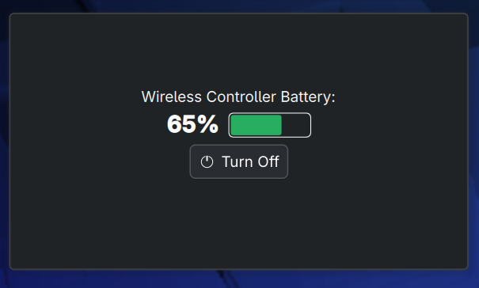

# PS5 Controller Battery Monitor



A cross-desktop Linux utility for monitoring Sony PS5 DualSense controller battery levels and turning them off directly from your system panel.

This project supports both **KDE Plasma 6** and **GNOME Shell (45+)**, providing native, beautifully integrated panel widgets for both desktop environments.

## Features

- **Multi-Controller Support:** Dynamically detects and lists multiple connected PS5 controllers.
- **Accurate Battery Reporting:** Reads battery levels directly from the Linux kernel `sysfs` power supply interface.
- **One-Click Turn Off:** Securely disconnects controllers to save battery life.
  - **Bluetooth:** Uses `bluetoothctl` to drop the wireless connection.
  - **USB:** Traces the kernel device tree to find the correct physical USB port and issues a targeted `USBDEVFS_RESET` ioctl hardware reset.
- **Visual Battery Bars:** (KDE) Dynamic, theme-aware bar graphs showing battery status (Red, Yellow, Green).

## System Requirements (Udev Rule)

For the "Turn Off" functionality to work over a wired USB connection without requiring root privileges, you must install the provided udev rule.

From the root of this project:
```bash
sudo cp 99-ps5-controller.rules /etc/udev/rules.d/
sudo udevadm control --reload-rules && sudo udevadm trigger
```
*(You may need to unplug and plug your controller back in once for the rule to take effect).*

## Desktop Environment Instructions

Because widget architectures differ completely between desktop environments, the source code and installation instructions are split into dedicated directories. 

Please navigate to the directory for your specific desktop environment for detailed build and installation instructions:

- **[KDE Plasma 6 (Plasmoid Widget)](kde/README.md)**
- **[GNOME Shell 45+ (GNOME Extension)](gnome/README.md)**

## Architecture 

Instead of relying on heavy compiled C++ daemons, this project uses a lightweight Python backend (`ps5_manager.py`) shared by both DE frontends. The desktop environments independently execute the python script on a timer, parsing the fast JSON output to draw their respective native UI elements.
